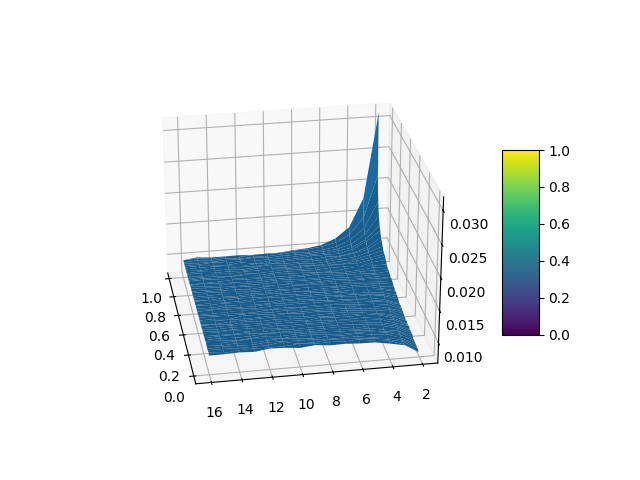

# Volume of a D-dimensional Hypersphere (CUDA/SIMD)

CS 547 High Performance Computing @ Binghamton University



## Submission

* release date 2024-04-29 (piazza)

* Deadline:
   * 2024-05-13 11:59 PM

Last working commit:
* [Insert last working commit]

## Execution
Included within the repository is a [Makefile](Makefile).

```shell
make # will make all targets.
```

### CPU (Standard) Implementation
```shell
make cpu && ./build/ball_samp-cpu
```

### CUDA Implmentation
```shell
make cuda && ./build/ball_samp-cuda
```

### SIMD Implementation
```shell
make simd && ./build/ball_samp-simd
```

## Generating 3D Surface Plot

Run the following command to generate a csv file containing the data for 
the probability given the dimension and the distance. 

   * Static images of the plot has been placed in (figures)[figures/] for
     convenience. 

```shell
 make cpu && ./build/ball_samp-cpu > data.csv
 ```

`graph.py` will read the data.csv at the project root and generate the 3D 
surface plot.

## Source
* https://cs.binghamton.edu/~kchiu/cs447/assign/final/